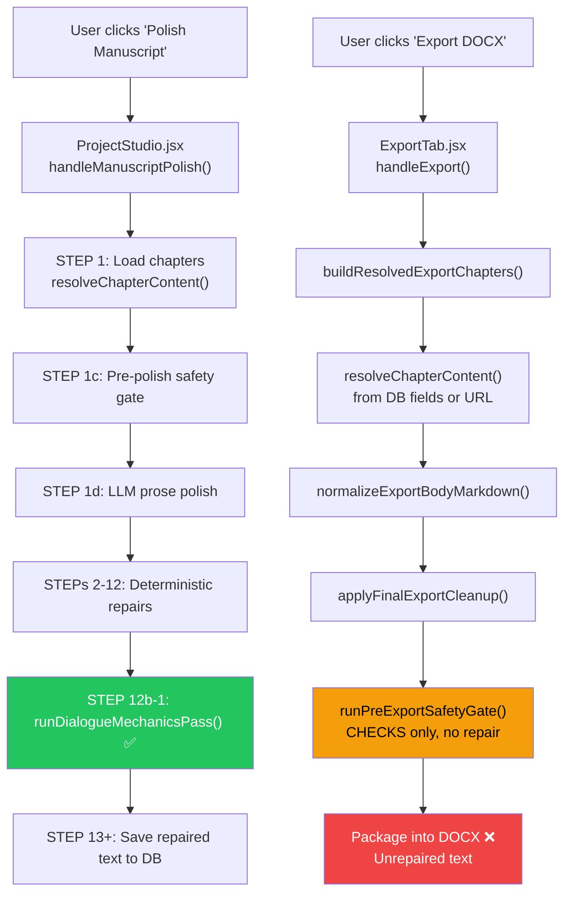

# Dialogue Repair Runtime Trace

> **Report 2 of 4** — Export-Resolved Dialogue Enforcement Hardfix
> Generated: 2026-06-08

## Executive Summary

The dialogue mechanics repair module (`dialogueMechanicsRepair.js`) is **fully functional** — it detects all 50 missing opening quote issues across 13 chapters and repairs every single one to 0 remaining. But the exported DOCX8 still contains these failures because **the repair module never executes on export-resolved text**. This report traces the exact runtime path to identify where the gap lives.

---

## Pipeline Architecture



---

## Trace: Polish Pipeline (WHERE REPAIR RUNS ✅)

### Entry Point
- **File**: [ProjectStudio.jsx](file:///Users/cliff/Downloads/UBS/src/pages/ProjectStudio.jsx#L3930)
- **Function**: `handleManuscriptPolish()` (line 3930)
- **Trigger**: User clicks "Polish Manuscript" button

### Import
```javascript
// ProjectStudio.jsx line 79
import { runDialogueMechanicsPass } from '@/lib/dialogueMechanicsRepair';
```

### Execution at STEP 12b-1
- **Location**: [ProjectStudio.jsx:4556-4577](file:///Users/cliff/Downloads/UBS/src/pages/ProjectStudio.jsx#L4556-L4577)
- **Label**: `'Polish: Repairing dialogue mechanics…'`

```javascript
// STEP 12b-1: Dialogue mechanics repair (line 4556)
setBusyLabel('Polish: Repairing dialogue mechanics…');
let dialogueRepairCount = 0;
let dialogueManualReviewCount = 0;
for (const f of loaded) {
  try {
    const dmResult = runDialogueMechanicsPass(f.content || '', {});
    if (dmResult.repairs.length > 0) {
      f.content = dmResult.text;  // ← repaired text replaces content
      dialogueRepairCount += dmResult.repairs.length;
      // ...
    }
  } catch (dmErr) {
    console.warn('[POLISH] Dialogue mechanics pass error:', dmErr?.message);
  }
}
```

### What happens after repair
- Repaired `f.content` is saved to DB via `prepareChapterContent()` + `Chapter.update()`
- The repaired text lives in the `content_md` or `content_md_url` field

### Confirmed Working
| Metric | Value |
|--------|-------|
| Total issues detected | 50 |
| Total issues repaired | 50 |
| Remaining after repair | 0 |
| Manual review items | 0 |
| Chapters affected | 13 of 20 |

---

## Trace: Export Pipeline (WHERE REPAIR DOES NOT RUN ❌)

### Entry Point
- **File**: [ExportTab.jsx](file:///Users/cliff/Downloads/UBS/src/components/publishing/ExportTab.jsx#L830)
- **Function**: `handleExport()` (line 830)
- **Trigger**: User clicks "Export DOCX" button

### Step 1: Resolve Chapters
- **Function**: `buildResolvedExportChapters()` (line 678)
- **Source priority**:
  1. Active editor content (if chapter is currently selected)
  2. `chapter.content_md` from local editor override
  3. Cached resolved `content_md` (from prior DB/URL resolution)
  4. Late `resolveChapterContent()` call as fallback

```javascript
// ExportTab.jsx line 707-712
} else if (String(chapter?.content_md || '').trim()) {
  markdown = String(chapter.content_md || '');
  sourceLabel = chapter?.resolved_content_loaded === false
    ? 'cached-prop-fallback'
    : 'cached-resolved-content_md';
}
```

> **Critical**: This content comes from whatever is stored in the DB field or URL. If the chapter was **never polished**, or was **re-fetched from URL after polish**, the content has **never been through dialogue repair**.

### Step 2: Normalize
- **Function**: `normalizeExportBodyMarkdown()` (line 748, defined at 2734)
- **Action**: Whitespace normalization only — no content repair

### Step 3: Final Export Cleanup
- **Function**: `applyFinalExportCleanup()` (line 762, defined at 2674)
- **Action**: Runs these passes:
  - `runExportTextSafetyNet()` — alias/mechanical cleanup (NO quote repair)
  - `runTerminalExportSourceGuard()` — source integrity
  - `removeForbiddenExportArtifactParagraphs()` — artifact removal
  - `uniquifyDuplicateExportChapterTitles()` — title dedup
  - `runCrossChapterExportRouteGuard()` — route collision
  - `thinSongbirdStyleTicsAcrossChapters()` — style thinning
  - `thinGenericStyleTicsAcrossChapters()` — generic thinning
  - `applyNonfictionSourceIntegrityExportCleanup()` — NF cleanup
  - `repairStyleThinningArtifacts()` — repair style artifacts
  - **NONE of these run `runDialogueMechanicsPass()` ❌**

### Step 4: Safety Gate
- **Function**: `runPreExportSafetyGate()` (line 803)
- **Module**: [exportSafetyGate.js](file:///Users/cliff/Downloads/UBS/src/lib/exportSafetyGate.js)
- **Action**: Detects dialogue issues via `detectExportDialogueIssues()` but:
  - **Only COUNTS issues** — does not repair them
  - **Dialogue issues are WARNING-ONLY** (line 120-125):

```javascript
// exportSafetyGate.js line 120-121
// Dialogue issues: warning-only (fixable by running Polish Manuscript)
// Process leaks, contamination, and malformed grammar remain hard blocks.
if (dialogueIssueCount > 5 && gate.ok) {
  entry.dialogueWarning = true;  // ← warning, NOT hard failure
}
```

### Step 5: Package DOCX
- The unrepaired text goes straight into DOCX generation
- Result: DOCX8 contains all 50 missing opening quote errors

---

## Import Analysis

| Module | Imports `dialogueMechanicsRepair.js`? | Runs repair? |
|--------|---------------------------------------|--------------|
| [ProjectStudio.jsx](file:///Users/cliff/Downloads/UBS/src/pages/ProjectStudio.jsx#L79) | ✅ `import { runDialogueMechanicsPass }` | ✅ At STEP 12b-1 |
| [ExportTab.jsx](file:///Users/cliff/Downloads/UBS/src/components/publishing/ExportTab.jsx) | ❌ Not imported | ❌ Never runs |
| [exportSafetyGate.js](file:///Users/cliff/Downloads/UBS/src/lib/exportSafetyGate.js#L19) | ⚠️ Lazy-loads `detectDialogueQuoteIssues` only | ❌ Detects, does NOT repair |

---

## Root Cause Answers

| Question | Answer |
|----------|--------|
| 1. Does `detectDialogueQuoteIssues()` detect them? | ✅ YES — all 50 |
| 2. Does `repairMissingDialogueOpeners()` repair them? | ✅ YES — 50→0 |
| 3. Does `runDialogueMechanicsPass()` run during polish? | ✅ YES — STEP 12b-1 |
| 4. Does it run before save? | ✅ YES — content saved after repair |
| 5. Does it run on LLM output (polished text)? | ✅ YES |
| 6. Does it run on export-resolved text? | ❌ **NO — THIS IS THE GAP** |
| 7. Are dialogue issues hard-blocked in export gate? | ❌ NO — warning-only |
| 8. Does export resolve content that may never have been polished? | ❌ YES — from DB fields/URLs |

---

## The Critical Gap

```
Polish Pipeline:  Load → LLM → Repairs → [STEP 12b-1: Dialogue Repair ✅] → Save
Export Pipeline:  Resolve → Normalize → Cleanup → Safety Gate (warn only) → DOCX ❌
                                                   ↑
                                              NO REPAIR HERE
```

Export resolves chapter content from stored fields/URLs. If a chapter was:
- **Never polished** (user exported before polishing)
- **Polished before STEP 12b-1 existed** (dialogue repair added later)
- **Re-fetched from URL after polish** (URL content is stale/unpolished)

…then the export packages **UNREPAIRED text** with all 50 missing opening quotes intact.

---

## Required Fix

Add a **pre-export surface repair pass** that runs `runDialogueMechanicsPass()` on the **exact text** export is about to package, **immediately before DOCX generation** — in the `buildResolvedExportChapters()` function, between `applyFinalExportCleanup()` (line 762) and the safety gate (line 803).
