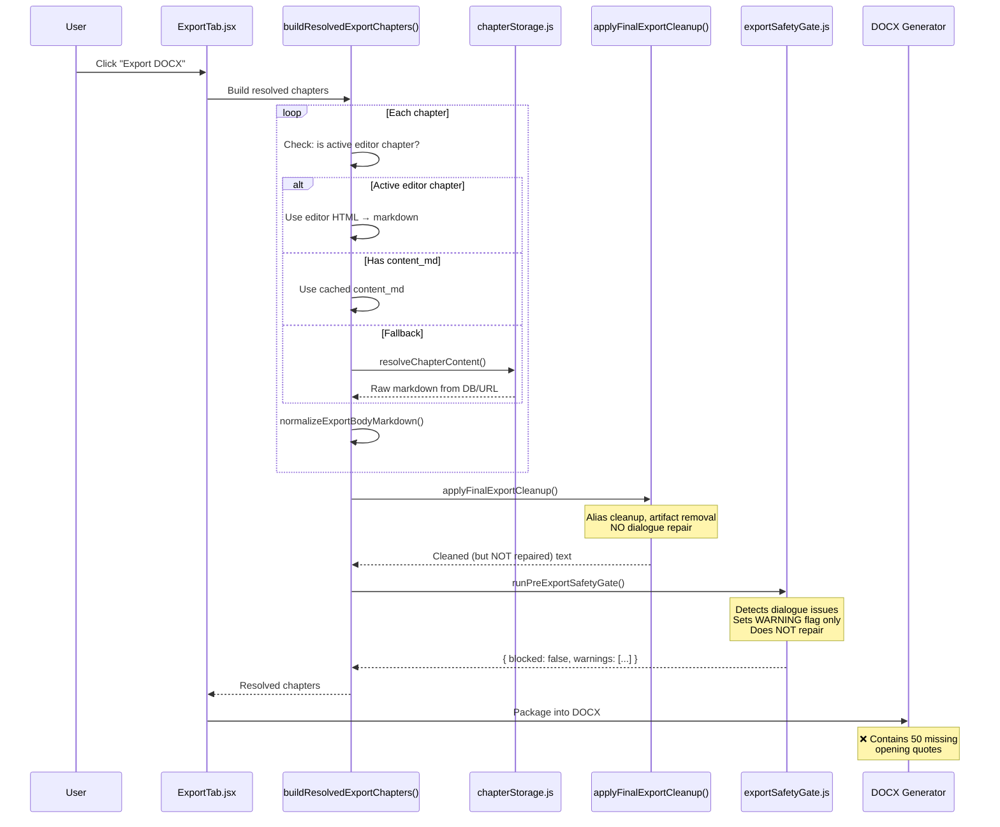

# Export-Resolved Text Trace

> **Report 3 of 4** — Export-Resolved Dialogue Enforcement Hardfix
> Generated: 2026-06-08

## Executive Summary

This report traces the **exact code path** that export uses to resolve chapter content, showing how unrepaired text flows from stored fields/URLs into the final DOCX. The safety gate detects dialogue issues but treats them as **warnings** — it never blocks and never repairs.

---

## Export Content Resolution Flow



---

## Content Resolution Priority Chain

The export resolves content through this priority chain in `buildResolvedExportChapters()` ([ExportTab.jsx:678-760](file:///Users/cliff/Downloads/UBS/src/components/publishing/ExportTab.jsx#L678-L760)):

| Priority | Source | Condition | Polished? |
|----------|--------|-----------|-----------|
| 1 | Active editor HTML | Chapter currently selected + loaded | Maybe |
| 2 | Local editor override | `chapter.local_editor_override` is true | Maybe |
| 3 | Cached `content_md` | `chapter.content_md` is non-empty | **Only if polished** |
| 4 | Late resolve from URL | `resolveChapterContent(freshChapter)` | **Unlikely** |
| 5 | Fallback fields scan | `content`, `chapter_text`, `draft`, `body`, etc. | **No** |

> **Key insight**: Priority 3 (`cached-resolved-content_md`) is the most common path. This content comes from whatever `resolveChapterContent()` returned during the Export tab's initial chapter resolution pass ([ExportTab.jsx:210-304](file:///Users/cliff/Downloads/UBS/src/components/publishing/ExportTab.jsx#L210-L304)). That resolution fetches the **stored** chapter content — which is only repaired if the user has already run Polish Manuscript.

---

## Content Resolution Source Code

### Initial Resolution (on Export tab load)

```javascript
// ExportTab.jsx line 218-251 — resolves on component mount
const results = await Promise.allSettled(
  chunk.map(async (chapter) => {
    try {
      const freshRecords = await runWithNetworkRetry(() =>
        base44.entities.Chapter.filter({ id: chapter.id })
      );
      const freshChapter = freshRecords?.[0] || chapter;
      const markdown = await resolveChapterContent(freshChapter);
      // ↑ Gets whatever is stored — may be UNPOLISHED
      return {
        ...chapter,
        ...freshChapter,
        content_md: markdown || '',  // ← stored as-is, no repair
      };
    } catch (err) {
      // Falls back to props — also may be unpolished
      const markdown = await resolveChapterContent(chapter);
      return { ...chapter, content_md: markdown || '' };
    }
  })
);
```

### Export-time Resolution

```javascript
// ExportTab.jsx line 707-712 — uses cached resolution
} else if (String(chapter?.content_md || '').trim()) {
  markdown = String(chapter.content_md || '');
  sourceLabel = chapter?.resolved_content_loaded === false
    ? 'cached-prop-fallback'
    : 'cached-resolved-content_md';
  // ↑ This is the most common path
  // The content was resolved from DB/URL on tab load
  // No dialogue repair has been applied
}
```

---

## Safety Gate: Detection Without Enforcement

### What the gate does
The export safety gate ([exportSafetyGate.js](file:///Users/cliff/Downloads/UBS/src/lib/exportSafetyGate.js)) runs `detectExportDialogueIssues()` — a lightweight inline copy of the detection logic:

```javascript
// exportSafetyGate.js line 71-77
// Dialogue issue detection (soft, non-blocking for < 6 issues)
let dialogueIssueCount = 0;
try {
  const dqIssues = detectExportDialogueIssues(content);
  dialogueIssueCount = dqIssues.count;
} catch (_e) { /* detection unavailable */ }
```

### What the gate does NOT do
1. **Does NOT import `repairMissingDialogueOpeners`** — only detects
2. **Does NOT import `runDialogueMechanicsPass`** — only the lazy-loaded detector
3. **Does NOT block export** for dialogue issues:

```javascript
// exportSafetyGate.js line 120-125
// Dialogue issues: warning-only (fixable by running Polish Manuscript)
// Process leaks, contamination, and malformed grammar remain hard blocks.
if (dialogueIssueCount > 5 && gate.ok) {
  entry.dialogueWarning = true;
  entry.reasons = [...(entry.reasons || []),
    `${dialogueIssueCount} missing opening quote dialogue issues — run Polish Manuscript to repair`];
}
```

### Gate Classification

| Issue Type | Gate Behavior | Should Be |
|------------|--------------|-----------|
| Process leaks | **HARD BLOCK** ✅ | Hard block |
| Contamination | **HARD BLOCK** ✅ | Hard block |
| Malformed grammar | **HARD BLOCK** ✅ | Hard block |
| Dialogue issues | **WARNING ONLY** ❌ | Hard block |
| Slop density | Warning | Warning (OK) |

---

## Key Evidence

### Evidence 1: Export gate comment explicitly acknowledges the gap

```javascript
// exportSafetyGate.js line 120
// Dialogue issues: warning-only (fixable by running Polish Manuscript)
```

This comment reveals the design assumption: dialogue repair was considered a **polish-time concern**, not an export-time concern. The assumption breaks when chapters bypass polish.

### Evidence 2: Export tab never imports dialogue repair

A search for `dialogueMechanicsRepair` in `ExportTab.jsx` returns **zero results**. The module is only imported in `ProjectStudio.jsx` (the polish pipeline).

### Evidence 3: Export safety gate lazy-loads DETECTOR only

```javascript
// exportSafetyGate.js line 18-29
let _detectDialogueQuoteIssues = null;
async function getDialogueDetector() {
  if (!_detectDialogueQuoteIssues) {
    try {
      const mod = await import('./dialogueMechanicsRepair.js');
      _detectDialogueQuoteIssues = mod.detectDialogueQuoteIssues;
      // ↑ Only imports the DETECTOR, not the REPAIRER
    } catch (_e) { }
  }
  return _detectDialogueQuoteIssues;
}
```

Note: This lazy-loaded detector is never actually called — the gate uses its own inline `detectExportDialogueIssues()` function instead (line 227). The lazy import is dead code.

### Evidence 4: No repair between safety gate and DOCX packaging

After `runPreExportSafetyGate()` returns (line 803), the code either throws (if blocked) or returns `cleaned` chapters (line 825). The cleaned chapters go directly to DOCX generation — **no dialogue repair step exists**.

```javascript
// ExportTab.jsx line 803-825
const safetyReport = runPreExportSafetyGate(cleaned, { project, stage: 'pre-export' });
if (safetyReport.blocked) {
  // ... throw tagged error
} else if (safetyReport.warnings.length > 0) {
  console.warn('[EXPORT] Safety gate warnings (export proceeding):', safetyReport.warnings);
}
return cleaned;  // ← directly returned, no repair applied
```

---

## Scenarios That Produce Unrepaired Export

### Scenario A: Chapter never polished
1. User generates chapters via LLM
2. User clicks "Export DOCX" without running "Polish Manuscript"
3. Export resolves raw LLM output — dialogue issues intact
4. Safety gate detects issues but only warns
5. DOCX contains unrepaired dialogue

### Scenario B: Polished before STEP 12b-1 existed
1. User polished manuscript before `dialogueMechanicsRepair.js` was added
2. Polished text was saved without dialogue repair (step didn't exist)
3. User exports — resolved text has no dialogue repair
4. DOCX contains unrepaired dialogue

### Scenario C: Content re-fetched from URL after polish
1. User polishes manuscript — repaired text saved to `content_md_url`
2. URL content is later overwritten or stale (platform caching issue)
3. Export resolves from URL — gets pre-repair content
4. DOCX contains unrepaired dialogue

### Scenario D: Editor text bypasses polish
1. User edits chapter text in Export tab editor
2. Edited text is saved via `handleSaveChapter()` — no polish step runs
3. Export uses editor text — no dialogue repair applied
4. DOCX contains unrepaired dialogue

---

## Conclusion

The export pipeline's content resolution path is completely disconnected from the dialogue repair module. The safety gate was explicitly designed to treat dialogue issues as **warnings** (line 120-121 comment: "fixable by running Polish Manuscript"), meaning the gate acknowledges the problem exists but defers repair to a different pipeline that may never run.

**Result**: All 50 missing opening quote issues survive into the exported DOCX8.
