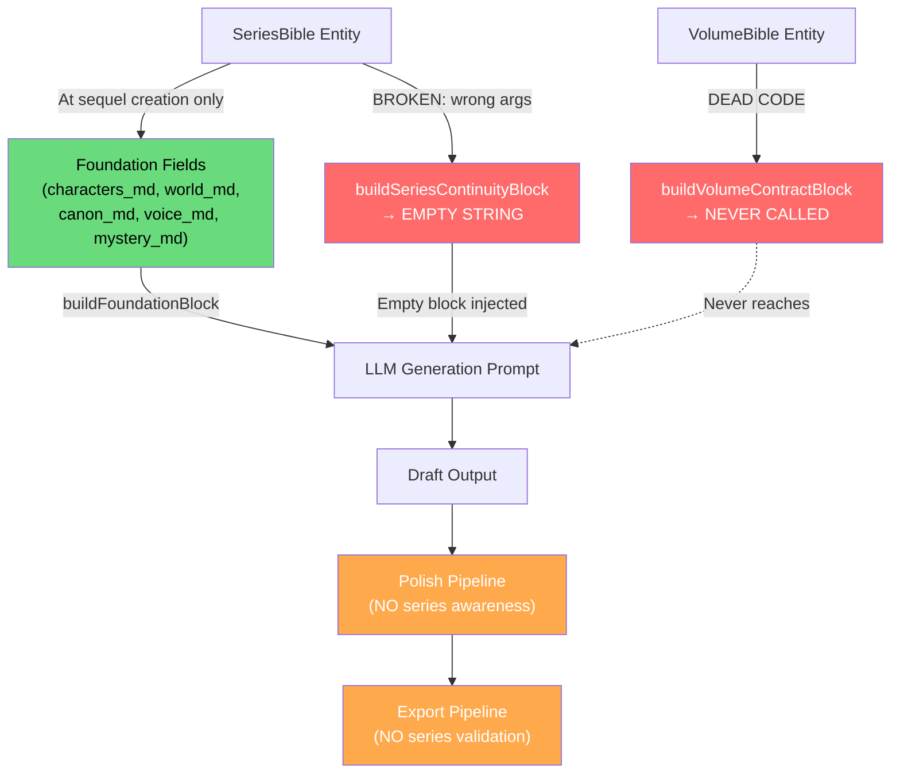

# Series Generation Wiring Trace

> **Generated**: 2026-06-09  
> **Scope**: All 12 user-facing paths that involve series data during generation, validation, or export  
> **Methodology**: Call-graph tracing from UI entry point → generation prompt → post-generation gate

---

## Wiring Trace Matrix

| # | Path | SeriesBible Used? | VolumeBible Used? | Entry Contract Used? | Exit Contract Used? | Series Context Reaches Prompt? | Post-Generation Gate? | Status |
|---|------|-------------------|-------------------|----------------------|---------------------|-------------------------------|----------------------|--------|
| 1 | **Create new series from existing projects** | ✅ YES (created) | ❌ NO | ❌ NO | ❌ NO | N/A (no generation) | N/A | ✅ **WORKS** |
| 2 | **Upload manuscript → extract series bible** | ✅ YES (extracted via `extractSeriesBible`) | ❌ NO | ❌ NO | ❌ NO | N/A (no generation) | N/A | ✅ **WORKS** |
| 3 | **Create standalone sequel** | ✅ YES (world/voice injected via `buildSeriesSeedConcept`) | ❌ NO | ❌ NO | ❌ NO | ✅ YES (via foundation fields: `world_md`, `voice_md`) | ❌ NO | ⚠️ **PARTIAL** |
| 4 | **Create true continuation** | ✅ YES (characters, threads, deaths, world injected via `buildSeriesSeedConcept` + foundation fields) | ❌ NO | ❌ NO | ❌ NO | ✅ YES (via foundation fields: `characters_md`, `world_md`, `canon_md`, `voice_md`, `mystery_md`) | ❌ NO | ⚠️ **PARTIAL** |
| 5 | **Create anthology volume** | ✅ YES (tone/theme injected via `buildSeriesSeedConcept`) | ❌ NO | ❌ NO | ❌ NO | ✅ YES (via foundation fields) | ❌ NO | ⚠️ **PARTIAL** |
| 6 | **Create spinoff** | ✅ YES (via `SpinoffView` foundation injection) | ✅ YES (if extracted — exit state used as spinoff starting point) | ❌ NO | ❌ NO | ✅ YES (via foundation fields) | ❌ NO | ⚠️ **PARTIAL** |
| 7 | **Rewrite volume** | ❌ NO (not injected into rewrite prompts) | ❌ NO | 👁️ DISPLAY ONLY (`RewriteVolumeView` shows contracts in UI) | 👁️ DISPLAY ONLY | ❌ NO | ❌ NO | ❌ **BROKEN** — contracts shown but never injected |
| 8 | **Draft chapter in linked volume** | ❌ BROKEN (`buildSeriesContinuityBlock` receives `project` instead of `(seriesBible, seriesNumber)` → empty block) | ❌ NO | ❌ NO (`buildVolumeContractBlock` is dead code) | ❌ NO | ⚠️ ONLY via static foundation fields from project creation | ❌ NO | ❌ **BROKEN** |
| 9 | **Rewrite chapter in linked volume** | ❌ BROKEN (same wrong-args bug as #8) | ❌ NO | ❌ NO (same dead code issue) | ❌ NO | ⚠️ ONLY via static foundation fields from project creation | ❌ NO | ❌ **BROKEN** |
| 10 | **Polish linked volume** | ❌ NO | ❌ NO | ❌ NO | ❌ NO | ❌ NO | ❌ NO | ❌ **ABSENT** — polish is entirely series-unaware |
| 11 | **Export linked volume** | ❌ NO | ❌ NO | ❌ NO | ❌ NO | ❌ NO | ❌ NO | ❌ **ABSENT** — export has zero series validation |
| 12 | **Merge volume into series bible** | ✅ YES (updated with deduped union merge) | ❌ NO | ❌ NO | ❌ NO | N/A (no generation) | N/A | ✅ **WORKS** |

---

## Path Detail Breakdown

### ✅ Working Paths (3 of 12)

| Path | Why It Works |
|------|-------------|
| **#1 — Create new series** | Pure entity creation. No generation dependency. `SeriesManager` `NewSeriesView` (L610–727) creates `SeriesBible` and links projects. |
| **#2 — Extract series bible** | Pure extraction. `extractSeriesBible` (L44–174) uses Gemini Flash with 2-chunk support. Output stored on `SeriesBible` entity. |
| **#12 — Merge into bible** | `MergeBookView` (L863–1043) performs deduped union merge of book content into series bible. Additive operation, no generation coupling. |

### ⚠️ Partial Paths (4 of 12)

| Path | What Works | What's Missing |
|------|-----------|----------------|
| **#3 — Standalone sequel** | World/voice reach LLM via `buildFoundationBlock` | No dynamic continuity. No contracts. No post-gen gate. Data is static snapshot. |
| **#4 — True continuation** | All 5 foundation fields populated (`characters_md`, `world_md`, `canon_md`, `voice_md`, `mystery_md`) | Same gaps as #3. Foundation fields never refresh from updated bible. |
| **#5 — Anthology volume** | Tone/theme reach LLM via foundation | Same gaps. Anthology isolation (L2078–2081) works correctly but is orthogonal. |
| **#6 — Spinoff** | Exit state from volume bible seeds foundation | Same gaps. Volume bible used at creation only, never during generation. |

### ❌ Broken Paths (3 of 12)

| Path | Root Cause | Impact |
|------|-----------|--------|
| **#7 — Rewrite volume** | `RewriteVolumeView` (L1514–1595) displays entry/exit contracts but never injects them into rewrite prompts. | Author sees contract constraints; LLM does not. Rewrites can violate series contracts silently. |
| **#8 — Draft chapter** | `getSeriesContinuity(project)` in `sceneWriter.js` (L1760) passes `project` to `buildSeriesContinuityBlock` which expects `(seriesBible, seriesNumber)`. All field accesses fail silently → empty string. `buildVolumeContractBlock` (L186–228) is dead code. | Series continuity block is always empty. The LLM receives no deaths, resolved threads, power shifts, or world-state changes. |
| **#9 — Rewrite chapter** | Same bug as #8 — shares the `getSeriesContinuity` code path. | Identical impact to #8. |

### ❌ Absent Paths (2 of 12)

| Path | What's Missing | Impact |
|------|---------------|--------|
| **#10 — Polish linked volume** | `llmProsePolisher.js`, `postDraftCleanup.js`, `finalProofread.js`, `proseQuality.js` contain zero references to series bibles, volume bibles, or continuity data. | Polish rewrites can introduce series contradictions: character name variations, world-term changes, timeline references that conflict with canon. |
| **#11 — Export linked volume** | `ExportTab.jsx`, `exportSafetyGate.js`, `buildBookHtml.js` contain zero series validation checks. | A manuscript with critical series contradictions (dead characters alive, resolved threads reopened) will export without any warning or blocking. |

---

## Data Flow Diagram

---

## Acceptance Criteria Evaluation

| Criterion | Met? | Details |
|-----------|------|---------|
| All linked-volume generation paths use series context | ❌ NO | Series continuity block is empty due to wrong-args bug in `getSeriesContinuity` → `buildSeriesContinuityBlock`. Only static foundation fields from creation time reach the LLM. Dynamic data (deaths, resolved threads, power shifts, world-state) never reaches the prompt. |
| Rewrite paths use entry/exit contracts | ❌ NO | `buildVolumeContractBlock` is dead code — defined in `volumeBible.js` (L186–228) but never imported or called. `RewriteVolumeView` displays contracts to the author but never injects them into rewrite prompts. |
| Export warns/blocks on critical series contradictions | ❌ NO | Export pipeline (`exportSafetyGate.js`, `buildBookHtml.js`, `ExportTab.jsx`) has zero series validation. Safety gate checks dialogue, slop density, and reference integrity but has no series continuity checks. |
| Series context survives reload | ⚠️ PARTIAL | Foundation fields (`characters_md`, `world_md`, `canon_md`, `voice_md`, `mystery_md`) persist on the project entity and survive reload. However, dynamic continuity data (deaths/losses, resolved threads, power shifts) never works due to the `buildSeriesContinuityBlock` wrong-args bug — so the question of "survives reload" is moot for that data. |

---

## Summary

> [!IMPORTANT]
> **3 of 12 paths work fully. 4 work partially (static data only). 5 are broken or absent.**
> 
> The series pipeline has comprehensive UI tooling (SeriesManager at 1,670 lines, 12 sub-views) and robust extraction capabilities, but the **generation wiring** is fundamentally broken. The two critical bugs — wrong arguments to `buildSeriesContinuityBlock` and dead-code `buildVolumeContractBlock` — mean that series context reaches the LLM only through foundation fields set at project creation time, with no dynamic continuity, no contract enforcement, and no post-generation validation.
