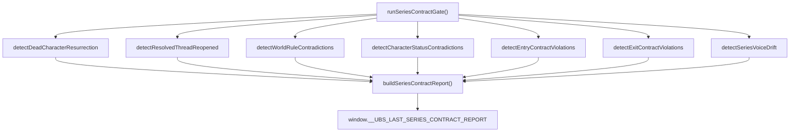

# Series Contract Gate — Design Document

> **Module**: `src/lib/seriesContractGate.js`
> **Status**: Implemented (not yet wired into pipelines)
> **Generated**: 2026-06-09

---

## Purpose

Validates generated or exported text against series/volume contracts. All checks are text-pattern-based (no LLM calls required). Designed to be wired into Draft All, Rewrite, Polish, and Export pipelines for linked volumes.

The gate catches continuity violations — dead characters appearing alive, resolved threads reopened, world rules contradicted — before they reach the reader. It operates deterministically, making it safe to run on every chapter without incurring LLM costs.

---

## Architecture

The gate operates at the text level, scanning prose for character names, thread keywords, and world facts drawn from the series and volume bibles. It does not call any LLM — all validation is deterministic pattern matching.



**Data flow**: The orchestrator (`runSeriesContractGate`) receives the raw text plus project metadata, series bible, and volume bible. It dispatches to individual detectors based on `project.series_flavor`. Each detector returns an array of findings with severity levels. The report builder aggregates all findings into a structured markdown report.

---

## Exports

| Function | Parameters | Severity | What It Checks |
|---|---|---|---|
| `runSeriesContractGate` | `(text, project, seriesBible, volumeBible, options)` | All | Orchestrator — runs all applicable checks based on `project.series_flavor` |
| `detectDeadCharacterResurrection` | `(text, seriesBible)` | BLOCK | Dead characters appearing alive/active (not in flashback/memory) |
| `detectResolvedThreadReopened` | `(text, seriesBible)` | BLOCK / WARNING | Resolved threads referenced with active conflict language |
| `detectWorldRuleContradictions` | `(text, seriesBible)` | WARNING | World rules (cannot/impossible/forbidden) contradicted in text |
| `detectCharacterStatusContradictions` | `(text, seriesBible, volumeBible)` | BLOCK / WARNING | Volume bible character statuses contradicted |
| `detectEntryContractViolations` | `(text, entryContract)` | BLOCK | Characters required alive/dead, open threads, world facts |
| `detectExitContractViolations` | `(text, exitContract)` | BLOCK | Characters must be alive/dead at end, thread state, cliffhangers |
| `detectSeriesVoiceDrift` | `(text, seriesBible, project)` | WARNING | POV shifts, tense drift, tonal inconsistency |
| `buildSeriesContractReport` | `(report)` | N/A | Markdown report formatter |
| `checkVolumeBibleStaleness` | `(project)` | N/A | Checks if volume bible is outdated |
| `computeVolumeBibleSourceHash` | `(chapters)` | N/A | Content fingerprint for staleness comparison |

---

## Severity Model

### BLOCK — Must fix before continuing

| Condition | Rationale |
|---|---|
| Dead character appears alive without flashback/memory context | Breaks reader trust in narrative consequences |
| Resolved thread reopened as active conflict | Undermines prior volume's resolution |
| Required entry condition contradicted (alive → dead or dead → alive) | Breaks inter-volume continuity contract |
| Required exit condition missing (character alive/dead state wrong) | Downstream sequel will inherit broken state |
| Major world rule contradiction | Violates established magic system / physics / law |

### WARNING — Review recommended

| Condition | Rationale |
|---|---|
| Resolved thread referenced (may be intentional callback) | Could be deliberate nostalgia vs. accidental reopening |
| World rule potentially contradicted (ambiguous match) | Pattern match uncertain — human judgment needed |
| Character transformation status ambiguous | Character may be in transition between states |
| Voice/POV/tense drift from series baseline | Stylistic inconsistency across volumes |
| Tone drift (dark series gets comedy markers) | Tonal whiplash between volumes |

### INFO — Manual review only

| Condition | Rationale |
|---|---|
| Entry contract world facts requiring manual review | Facts present but context unclear |
| Exit contract threads/cliffhangers requiring manual review | Thread state ambiguous from text alone |

---

## Detection Algorithms

### 1. Dead Character Detection

**Source data**: `deaths_and_losses` field from series bible + `characters_json` entries where `status_at_end = "dead"`.

**Algorithm**:
1. Extract all dead character names from the series bible.
2. For each name found in the text, call `nameAppearsAsActive()`.
3. `nameAppearsAsActive()` splits text into paragraphs, then checks for:
   - **Active verb proximity**: Action verbs and dialogue attribution near the character name (said, walked, grabbed, shouted, etc.)
   - **Dialogue attribution**: `"..." {name} said` or `{name} said "..."`
4. **Exclusion contexts** — matches are suppressed if the surrounding paragraph contains flashback/memory markers:
   - `remembered`, `memory`, `flashback`, `grave`, `tombstone`, `portrait`, `ghost`, `spirit`, `dream`, `vision`, `recalled`, `once said`, `used to`
5. If a dead character appears active outside exclusion contexts → **BLOCK**.

### 2. Resolved Thread Detection

**Source data**: `resolved_threads` field from series bible.

**Algorithm**:
1. Extract key phrases from each resolved thread (3+ word sequences of significant words, stop words excluded).
2. Scan the text for matches against these phrases.
3. If multiple phrase matches are found **and** the surrounding context contains active conflict language markers:
   - `must stop`, `threatens`, `resurfaced`, `not over`, `returned`, `once again`, `rises again`, `back from`, `has returned`, `new threat`
4. Multiple matches + conflict language → **BLOCK**. Single match or no conflict language → **WARNING** (possible intentional callback).

### 3. World Rule Detection

**Source data**: `rules_and_systems` field from series bible.

**Algorithm**:
1. Parse `rules_and_systems` for negation patterns:
   - `cannot`, `impossible`, `never`, `forbidden`, `no one can`, `must not`, `unable to`
2. Extract the forbidden action/capability from each negation pattern.
3. Scan the text for the forbidden action appearing **without** its negation (i.e., the action is performed or described as possible).
4. Match found → **WARNING** (world rules often have nuanced exceptions that require human review).

### 4. Entry/Exit Contract Detection

**Source data**: Entry and exit contracts from the volume bible.

**Algorithm — Entry Contracts**:
1. For each character with a required alive/dead status:
   - If required alive: check that `nameAppearsAsActive()` returns true and no death phrases appear.
   - If required dead: check that the character does not appear active (using same logic as dead character detection).
2. For each required open thread: check that thread keywords appear in the text.
3. For each required world fact: flag for manual review (INFO severity).
4. Status contradiction → **BLOCK**. Missing thread → **BLOCK**.

**Algorithm — Exit Contracts**:
1. For each character with a required end-state (alive/dead): validate against final chapters.
2. For each thread that must be resolved/open: check thread keyword presence and resolution language.
3. For cliffhangers: flag for manual review (INFO severity).
4. Status contradiction → **BLOCK**. Thread state wrong → **BLOCK**.

### 5. Voice Drift Detection

**Source data**: Series bible voice/style fields + `project.series_flavor`.

**Algorithm**:
1. **POV marker counting**: Tally first-person markers (`I`, `me`, `my`, `mine`, `myself`) vs. third-person markers (`he`, `she`, `they`, `his`, `her`, `their`). Compare ratio against series baseline.
2. **Tense marker counting**: Tally present-tense verbs vs. past-tense verbs. Compare dominant tense against series baseline.
3. **Tone marker scanning**: Check for tonal inconsistency markers:
   - Dark/serious series: flag excessive comedy markers (laughed uproariously, hilarious, comedy of errors)
   - Light/comedic series: flag excessive grimdark markers (blood-soaked, merciless, relentless suffering)
4. Significant drift from baseline → **WARNING**.

---

## Wiring Points

> [!IMPORTANT]
> The gate is implemented but **not yet wired** into any pipeline. The following are the planned integration points (future work).

| Pipeline Stage | File | Integration Point |
|---|---|---|
| Chapter generation | [sceneWriter.js](file:///Users/cliff/Downloads/UBS/src/lib/sceneWriter.js) | After each chapter generation, before storing output |
| Polish pass | [llmProsePolisher.js](file:///Users/cliff/Downloads/UBS/src/lib/llmProsePolisher.js) | After polish completes, before accepting polished text |
| Export | [ExportTab.jsx](file:///Users/cliff/Downloads/UBS/src/components/ExportTab.jsx) | Before final export, alongside existing `exportSafetyGate` |
| Sequel/Spinoff creation | [SeriesManager.jsx](file:///Users/cliff/Downloads/UBS/src/components/SeriesManager.jsx) | Before sequel/spinoff creation if volume bible is stale |

### Wiring Pattern (Example)

```javascript
// In sceneWriter.js, after chapter generation:
import { runSeriesContractGate } from './seriesContractGate.js';

const contractReport = runSeriesContractGate(
  chapterText,
  project,
  seriesBible,
  volumeBible,
  { phase: 'generation' }
);

if (contractReport.blocks.length > 0) {
  // Surface BLOCK findings to user, halt pipeline
}
```

---

## Storage

| Global Key | Contents | Lifecycle |
|---|---|---|
| `window.__UBS_LAST_SERIES_CONTRACT_REPORT` | Latest contract check result from any pipeline stage | Overwritten on each `runSeriesContractGate` call |
| `window.__UBS_LAST_EXPORT_SERIES_REPORT` | Latest export-specific check result | Overwritten on each export-phase gate run |

Both are plain JavaScript objects with the following shape:

```javascript
{
  timestamp: ISO8601,
  phase: 'generation' | 'polish' | 'export',
  blocks: [{ detector, message, evidence }],
  warnings: [{ detector, message, evidence }],
  infos: [{ detector, message, evidence }],
  pass: boolean  // true if blocks.length === 0
}
```

---

## Related Reports

| Report | Path |
|---|---|
| Series Pipeline Audit | `01-series-pipeline-audit.md` |
| Bug Catalog | `02-bug-catalog.md` |
| Volume Bible Refresh Strategy | `04-volume-bible-refresh-strategy.md` |
