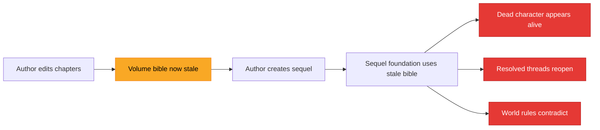

# Volume Bible Refresh Strategy

> **Status**: Proposed (staleness utilities implemented in `seriesContractGate.js`)
> **Generated**: 2026-06-09

---

## Current State

Volume bibles are extracted on demand via `VolumeBiblesView` (a sub-view of [SeriesManager.jsx](file:///Users/cliff/Downloads/UBS/src/components/SeriesManager.jsx)). The extraction pipeline works correctly — `extractVolumeBible`, `extractAllVolumeBibles`, and `saveVolumeBible` all function as expected.

> [!WARNING]
> **No timestamp, no staleness tracking, no source hash.** A volume bible extracted before edits silently drives sequel generation. If an author rewrites Act 3, kills off a character, and then creates a sequel — the sequel's foundation will be built from the pre-rewrite volume bible, treating the killed character as alive.

### Impact Chain



---

## Staleness Triggers

Volume bible should be marked stale when any of the following occur:

| Trigger | Source | Likelihood |
|---|---|---|
| Chapter content changes (edit, rewrite, safe-replace) | Manual editing or rewrite pipeline | **High** — most common editing action |
| Chapter count changes (add/delete chapter) | Chapter management UI | **Medium** — structural edits |
| Polish pipeline runs | `llmProsePolisher.js`, `postDraftCleanup.js`, `finalProofread.js` | **High** — polish can change names, fix facts |
| Manuscript import replaces content | Import flow | **Low** — but catastrophic if missed |

---

## Refresh Triggers

Volume bible should auto-refresh or prompt refresh when the author initiates any of these operations:

| Operation | Sub-View | Risk if Stale |
|---|---|---|
| Creating sequel | `SequelView` | Foundation built on wrong character/thread state |
| Creating spinoff | `SpinoffView` | World facts and character arcs incorrect |
| Merging into series bible | `MergeBookView` | Series bible absorbs outdated data |
| Running series critic | `SeriesCriticView` | Critic evaluates against wrong baseline |
| Running series polish | `SeriesPolishView` | Polish may "fix" things that were intentionally changed |
| Exporting series bible | Export flow | Published bible contains stale data |
| Rewriting linked volume | Rewrite pipeline | Rewrite guided by outdated constraints |

---

## Proposed Fields on NovelProject

| Field | Type | Purpose |
|---|---|---|
| `volume_bible_updated_at` | ISO timestamp (string) | When the volume bible was last extracted |
| `volume_bible_source_hash` | string | Content fingerprint (chapter count + word count + first/last chapter IDs) |
| `volume_bible_stale` | boolean | Explicitly flagged stale |

### Source Hash Format

```
ch{count}-w{totalWords}-f{firstChapterId}-l{lastChapterId}
```

**Example**: `ch24-w87342-f1a2b3c4-l9z8y7x6`

The hash changes when:
- Chapters are added or removed (count changes)
- Content is edited (word count changes)
- Chapters are reordered (first/last ID changes)

> [!NOTE]
> The hash is a lightweight fingerprint, not a cryptographic hash. It is designed to detect the most common staleness triggers quickly. Deep content changes that preserve exact word count would not be caught — but such edits are statistically rare and the hash is a first-pass filter, not the only safeguard.

---

## Implementation Plan

### Step 1 — Hash Computation (✅ Implemented)

`computeVolumeBibleSourceHash(chapters)` is already implemented in [seriesContractGate.js](file:///Users/cliff/Downloads/UBS/src/lib/seriesContractGate.js).

```javascript
// Returns: "ch{count}-w{totalWords}-f{firstId}-l{lastId}"
const hash = computeVolumeBibleSourceHash(project.chapters);
```

### Step 2 — Staleness Check (✅ Implemented)

`checkVolumeBibleStaleness(project)` is already implemented in [seriesContractGate.js](file:///Users/cliff/Downloads/UBS/src/lib/seriesContractGate.js).

```javascript
// Returns: { stale: boolean, reason: string, lastUpdated: string|null }
const status = checkVolumeBibleStaleness(project);
```

### Step 3 — Staleness Detection at Chapter Save (🔲 Not Yet Implemented)

When chapters are saved or updated, compare the current source hash to the stored hash. If different, set `volume_bible_stale: true`.

**Wiring point**: Chapter save handler (wherever `project.chapters` is persisted).

```javascript
// Pseudocode for chapter save handler:
const currentHash = computeVolumeBibleSourceHash(project.chapters);
if (currentHash !== project.volume_bible_source_hash) {
  project.volume_bible_stale = true;
  // Do NOT update the hash — that happens on re-extraction
}
```

### Step 4 — UI Warning (🔲 Not Yet Implemented)

| Location | Indicator | Behavior |
|---|---|---|
| `VolumeBiblesView` → `VolumeCard` | Amber warning badge | "Volume bible may be outdated — content has changed since last extraction" |
| `SequelView` | Prompt dialog | "Volume bible is stale — refresh before continuing?" with Refresh / Continue Anyway buttons |
| `SpinoffView` | Prompt dialog | Same as SequelView |
| `MergeBookView` | Prompt dialog | "Volume bible is stale — merge may propagate outdated data. Refresh first?" |

### Step 5 — Block Stale-Driven Sequel (🔲 Not Yet Implemented)

If `volume_bible_stale` is `true` **and** `series_flavor` is `'continuation'`, show a hard warning before allowing sequel creation. Continuation series have the tightest continuity requirements — a stale bible here is most dangerous.

```javascript
// In SequelView, before creating sequel:
if (project.volume_bible_stale && project.series_flavor === 'continuation') {
  // Show blocking dialog:
  // "This volume's bible is outdated. Creating a continuation sequel
  //  with stale data will produce incorrect character states and
  //  thread continuity. Please refresh the volume bible first."
  // [Refresh Now] [Cancel]
}
```

---

## Extraction-Time Updates

When `extractVolumeBible` or `extractAllVolumeBibles` runs successfully, the following fields should be updated on the project:

```javascript
project.volume_bible_updated_at = new Date().toISOString();
project.volume_bible_source_hash = computeVolumeBibleSourceHash(project.chapters);
project.volume_bible_stale = false;
```

This ensures the staleness flag is cleared and the hash baseline is reset to the current content state.

---

## Acceptance Criteria

| # | Criterion | Status |
|---|---|---|
| 1 | Stale volume bibles cannot silently drive sequel generation | 🔲 Not yet enforced |
| 2 | Stale indicator visible in `VolumeBiblesView` | 🔲 Not yet implemented |
| 3 | Refresh prompt appears before critical operations (sequel, spinoff, merge) | 🔲 Not yet implemented |
| 4 | `computeVolumeBibleSourceHash` returns consistent hash for same content | ✅ Implemented |
| 5 | `checkVolumeBibleStaleness` correctly detects missing/outdated bibles | ✅ Implemented |
| 6 | Hash updates on successful volume bible extraction | 🔲 Not yet wired |

---

## Related Reports

| Report | Path |
|---|---|
| Series Pipeline Audit | `01-series-pipeline-audit.md` |
| Bug Catalog | `02-bug-catalog.md` |
| Series Contract Gate Design | `03-series-contract-gate-design.md` |
