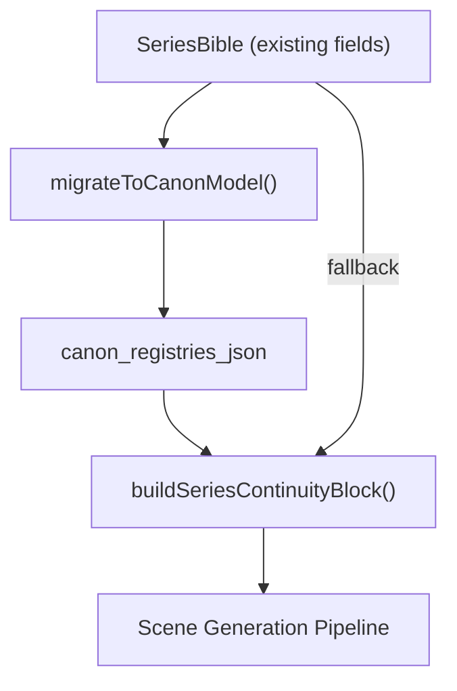

# Series Bible Canon Model — Improvement Design

## Current Model

The current `SeriesBible` entity stores everything as flat text/JSON fields. When books are merged via `MergeBookView`, text fields are appended with `--- Merged from: [title] ---` separators. Array fields are union-merged. This creates growing, unsorted blobs that don't distinguish between current state and historical events.

> [!WARNING]
> The current flat-field model degrades as series length increases. By volume 5+, fields like `deaths_and_losses`, `resolved_threads`, and `world_md` become unwieldy blobs with no temporal ordering or book-level attribution.

## Proposed Canon Model

Organize the series bible into **7 registries**, each serving a distinct purpose in the generation pipeline.

---

### 1. Historical Timeline

What happened across books, in order.

```json
{
  "events": [
    {
      "book": 1,
      "order": 1,
      "event": "...",
      "significance": "major|minor",
      "characters_involved": []
    }
  ]
}
```

| Field | Type | Description |
|---|---|---|
| `book` | number | Volume number where event occurred |
| `order` | number | Sequence within the book |
| `event` | string | Description of the event |
| `significance` | enum | `major` or `minor` — controls inclusion in continuity blocks |
| `characters_involved` | string[] | Character names involved in the event |

---

### 2. Current Canon State

What is true **NOW** (at the end of the latest analyzed volume).

- World state (current)
- Active rules and systems
- Power balance
- Political landscape
- Active unresolved threads

> [!IMPORTANT]
> This registry replaces the need to scan all accumulated text fields. The generation pipeline should read **this** registry for "what is true right now" instead of parsing the merged blob fields.

---

### 3. Book-by-Book State

Snapshot of truth at each volume ending. Replaces the current `volume_bible_json` approach with a series-level view.

```json
{
  "book_1": {
    "world_at_end": "...",
    "characters_at_end": ["..."],
    "threads_at_end": ["..."]
  },
  "book_2": {
    "world_at_end": "...",
    "characters_at_end": ["..."],
    "threads_at_end": ["..."]
  }
}
```

| Field | Type | Description |
|---|---|---|
| `world_at_end` | string | World state snapshot at volume conclusion |
| `characters_at_end` | string[] | Character status list at volume conclusion |
| `threads_at_end` | string[] | Open/closed thread list at volume conclusion |

---

### 4. Reader Knowledge

What the reader knows vs. what characters know.

| Category | Description |
|---|---|
| Secrets revealed to reader | Information the reader has but characters don't |
| Secrets remaining | Information neither reader nor characters have |
| Dramatic irony opportunities | Situations where reader knowledge creates tension |

---

### 5. Character Registry

| Field | Description |
|---|---|
| `name` | Canonical name |
| `aliases` | Nicknames, titles, code names |
| `status` | `alive` / `dead` / `transformed` / `missing` / `unknown` |
| `status_since_book` | Which book set current status |
| `last_seen_book` | Last volume where character appeared |
| `relationships` | Map of character → relationship |
| `power_role` | Current power/role in the world |
| `forbidden_states` | e.g., "cannot be resurrected" — hard constraints |
| `arc_summary` | Brief arc across all books |

---

### 6. World Rule Registry

| Field | Description |
|---|---|
| `rule` | The rule statement |
| `source_book` | Where it was established |
| `status` | `active` / `modified` / `deprecated` |
| `exceptions` | Known exceptions |
| `contradictions` | Any known contradictions |

---

### 7. Thread Registry

| Field | Description |
|---|---|
| `thread` | Description |
| `opened_in` | Which book introduced it |
| `addressed_in` | Books where it was touched |
| `resolved_in` | Book where it was resolved (`null` if open) |
| `stale_age` | Number of books since last addressed |
| `payoff_plan` | Author's intended resolution |

---

## Migration Strategy

| Step | Action | Risk |
|---|---|---|
| 1 | Keep all existing fields readable | None — no changes to existing data |
| 2 | Add new `canon_registries_json` field to `SeriesBible` | Low — additive schema change |
| 3 | Create `migrateToCanonModel(existingBible)` function that reads old fields and populates registries | Medium — parsing merged blobs is lossy |
| 4 | New registries are additive — old fields remain for backward compatibility | None — no destructive changes |
| 5 | Update `buildSeriesContinuityBlock` to read from registries when available, fall back to old fields | Low — graceful degradation |

> [!CAUTION]
> **Migration rules:**
> - DO NOT destroy existing data
> - Migrate safely — `migrateToCanonModel` must be idempotent
> - Keep old fields readable at all times
> - New model is opt-in enhancement, not forced migration

### Integration with Existing Pipeline

The new canon model must integrate with the generation pipeline at the points where series data is currently consumed:



1. **`buildSeriesContinuityBlock`** ([seriesBible.js L226](file:///Users/cliff/Downloads/UBS/src/lib/seriesBible.js#L226)) — Updated to read from registries first, fall back to flat fields
2. **`getSeriesContinuity`** ([sceneWriter.js L1760](file:///Users/cliff/Downloads/UBS/src/lib/sceneWriter.js#L1760)) — Must pass correct arguments (currently broken: passes `project` instead of `(seriesBible, seriesNumber)`)
3. **`seriesContractGate`** ([seriesContractGate.js](file:///Users/cliff/Downloads/UBS/src/lib/seriesContractGate.js)) — Can leverage structured registries for more precise validation

## Risk Assessment

| Risk | Severity | Mitigation |
|---|---|---|
| Data loss during migration | **High** | Migration is additive-only; old fields never deleted |
| Incorrect parsing of merged blobs | **Medium** | `migrateToCanonModel` uses conservative parsing; unknown data goes to `unclassified` bucket |
| Pipeline reads wrong source | **Medium** | Registry-first with fallback pattern; both paths tested |
| Schema bloat | **Low** | `canon_registries_json` is a single JSON field; no schema explosion |
| Backward compatibility break | **Low** | Old fields remain; new registries are opt-in |
