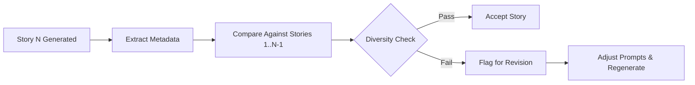

# Anthology & Spinoff Hardening

## Anthology Mode

### Current Behavior

- Anthology isolation is enforced via prompting ([anthologyEngine.js L217-284](file:///Users/cliff/Downloads/UBS/src/lib/anthologyEngine.js#L217-L284) has explicit isolation rules)
- [sceneWriter.js L2078-2081](file:///Users/cliff/Downloads/UBS/src/lib/sceneWriter.js#L2078-L2081) zeroes rolling context, previous chapter tails, and prior summaries for anthology chapters
- Each story gets a **COMPLETE CONTEXT RESET** prompt
- `seriesContinuityBlock` is still injected for anthologies (probably wrong but harmless since the block is currently empty due to the [buildSeriesContinuityBlock argument mismatch bug](file:///Users/cliff/Downloads/UBS/src/lib/sceneWriter.js#L1760))

> [!NOTE]
> The context zeroing in `sceneWriter.js` is one of the best-implemented series-aware features in the codebase. It correctly prevents cross-story contamination at the code level, not just the prompt level.

### Hardening Requirements

| Rule | Current Status | Recommendation |
|---|---|---|
| Shared theme enforcement | ✅ Prompt-level | Add theme consistency check in contract gate |
| No accidental continuity carryover | ✅ Code-level (context zeroing) | Maintain — working correctly |
| Story variety (no repeated twists) | ❌ Not enforced | Add twist/ending registry to prevent repeats |
| No repeated ending type | ❌ Not enforced | Track ending types across stories |
| No repeated protagonist archetype | ❌ Not enforced | Track protagonist traits across stories |
| No contamination from prior story | ✅ Code-level | Maintain — zeroing works |
| Recurring frame (if intentional) | ❌ Not supported | Add `frame_story` flag to anthology config |

### Proposed: Anthology Diversity Gate

After each story is generated, check against previous stories in the same anthology for:

| Check | Description | Implementation |
|---|---|---|
| **Name collisions** | Character names reused across stories | Compare character name lists between stories; flag exact or near-matches |
| **Setting duplication** | Same location/world reused | Extract setting descriptors; compare via fuzzy match |
| **Twist type repetition** | Same surprise mechanism used twice | Classify twist types (betrayal, reveal, reversal, etc.); enforce variety |
| **Ending pattern repetition** | Same resolution pattern | Classify endings (happy, tragic, ambiguous, cliffhanger, etc.); enforce variety |



> [!TIP]
> The diversity gate should run **after** story generation but **before** final polish, so regeneration doesn't waste polish tokens.

---

## Spinoff Mode

### Current Behavior

- `SpinoffView` ([SeriesManager L1410-1509](file:///Users/cliff/Downloads/UBS/src/components/SeriesManager.jsx#L1410-L1509)) creates new project from volume exit state
- Inherits characters, world, unresolved threads from volume bible
- Falls back to series-level data if no volume bible
- Sets `series_flavor='standalone'` with `flavor_note` describing branch point
- Copies author/genre/style settings from source volume

### Hardening Requirements

| Rule | Current Status | Recommendation |
|---|---|---|
| Branch point documented | ✅ `series_flavor_note` | Sufficient |
| Inherited world facts | ✅ `world_md` populated | Add `world_facts_assumed` to entry contract |
| Inherited character statuses | ✅ `characters_md` populated | Good — but status not enforced at generation time |
| Allowed references to main series | ❌ Not controlled | Add reference policy (`free` / `restricted` / `forbidden`) |
| Forbidden contradictions | ❌ Not enforced | Wire `seriesContractGate` for spinoffs |
| Independence score | ❌ Not tracked | Add metric: % of unique characters/settings vs inherited |
| Spoiler control | ❌ Not implemented | Add `spoiler_safe` flag that restricts references to events after branch point |

### Proposed: Spinoff Reference Policy

Three reference modes for spinoff projects:

| Mode | Behavior | Use Case |
|---|---|---|
| `free` | Spinoff can reference any event/character from main series | Direct sequel in alternate timeline |
| `restricted` | Spinoff can reference world/rules but not specific events | Same-world new cast story |
| `forbidden` | Spinoff inherits initial state only; no back-references allowed | Fully independent story inspired by the world |

### Proposed: Spoiler Control

When `spoiler_safe` is enabled:

1. **Branch point** is recorded as `(series_id, book_number, chapter_number)`
2. **Events after branch point** in the main series are marked as `spoiler_restricted`
3. Generation prompts include: *"This story branches from [series] after Book X, Chapter Y. Do not reference or imply any events from Book X Chapter Y+1 onward."*
4. `seriesContractGate` validates no spoiler-restricted events appear in generated text

> [!WARNING]
> Spoiler control requires the proposed [Canon Model's Historical Timeline registry](file:///Users/cliff/Downloads/UBS/smoke-test-output/series-pipeline-hardening/05-series-bible-canon-model.md) to know which events occurred after the branch point. Without the timeline registry, spoiler control must rely on prompt-level enforcement only.

### Proposed: Independence Score

Track how much of a spinoff's content is original vs inherited:

```
independence_score = unique_elements / (unique_elements + inherited_elements)
```

| Element Type | Counted As |
|---|---|
| New characters (not in source) | Unique |
| Inherited characters (from source) | Inherited |
| New locations | Unique |
| Inherited locations | Inherited |
| New world rules | Unique |
| Inherited world rules | Inherited |

| Score Range | Classification |
|---|---|
| 0.0 – 0.3 | Heavy spinoff (mostly inherited) |
| 0.3 – 0.6 | Balanced spinoff |
| 0.6 – 1.0 | Loosely connected (mostly original) |

> [!NOTE]
> Independence score is informational, not a gate. Authors may intentionally want heavy spinoffs. The score helps them understand the balance.

---

## Summary: Priority Matrix

| Feature | Mode | Effort | Impact | Priority |
|---|---|---|---|---|
| Anthology diversity gate | Anthology | Medium | High — prevents repetitive collections | **P1** |
| Twist/ending registry | Anthology | Low | Medium — improves variety | **P1** |
| Frame story support | Anthology | Low | Low — niche use case | **P3** |
| Reference policy | Spinoff | Medium | High — controls canon leakage | **P1** |
| Wire `seriesContractGate` for spinoffs | Spinoff | Low | High — prevents contradictions | **P1** |
| Spoiler control | Spinoff | High | Medium — requires canon model | **P2** |
| Independence score | Spinoff | Low | Low — informational only | **P3** |
