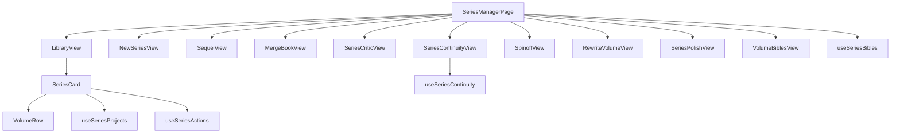

# SeriesManager.jsx Refactor Plan

> **Status**: Planning · **Target**: `src/pages/series/SeriesManager.jsx` (1,670 lines)
> **Generated**: 2025-06-09

---

## Current State

`SeriesManager.jsx` is 1,670 lines containing 10+ inline sub-views, all in a single file. This makes it hard to test, maintain, and extend.

The component acts as a monolithic router/state-container that renders different sub-views based on internal state, with all view logic, handlers, API calls, and UI markup co-located in a single module. Key problems:

- **Testability** — individual views cannot be unit-tested in isolation
- **Maintainability** — any change risks regressions across unrelated views
- **Extensibility** — adding new series features (e.g., series-aware polish, export validation) means further bloating this file
- **Code review** — diffs touch 1,670 lines even for single-view changes

---

## Proposed Component Extraction

Create a `src/pages/series/` directory and extract each sub-view into its own file:

| Component | Source Lines | Extract To | Priority |
|---|---|---|---|
| SeriesManagerPage (router/state) | L1-147 | `src/pages/series/SeriesManagerPage.jsx` | **HIGH** |
| LibraryView | L148-185 | `src/pages/series/SeriesLibraryView.jsx` | **HIGH** |
| SeriesCard | L189-458 | `src/pages/series/SeriesCard.jsx` | **HIGH** |
| VolumeRow | L472-601 | `src/pages/series/VolumeRow.jsx` | **MEDIUM** |
| NewSeriesView | L610-727 | `src/pages/series/NewSeriesView.jsx` | **MEDIUM** |
| SequelView | L732-858 | `src/pages/series/SequelView.jsx` | **MEDIUM** |
| MergeBookView | L863-1043 | `src/pages/series/MergeBookView.jsx` | **MEDIUM** |
| SeriesCriticView | L1048-1243 | `src/pages/series/SeriesCriticView.jsx` | **LOW** |
| SeriesContinuityView | L1248-1405 | `src/pages/series/SeriesContinuityView.jsx` | **LOW** |
| SpinoffView | L1410-1509 | `src/pages/series/SpinoffView.jsx` | **LOW** |
| RewriteVolumeView | L1514-1595 | `src/pages/series/RewriteVolumeView.jsx` | **LOW** |
| Helpers (buildSeriesSeedConcept, buildFlavorNote) | L1597-1670 | Keep in `src/lib/seriesBible.js` or new `src/lib/seriesHelpers.js` | **MEDIUM** |

> [!NOTE]
> Line numbers are approximate based on the current version of `SeriesManager.jsx`. Verify before beginning extraction.

---

## Proposed Hooks

| Hook | Purpose | Source |
|---|---|---|
| `useSeriesBibles()` | Load/refresh SeriesBible entities | Extract from SeriesManagerPage state management |
| `useSeriesProjects(bibleId)` | Load projects linked to a series | Extract from SeriesCard |
| `useSeriesActions(bible)` | Merge, export, duplicate, delete actions | Extract from SeriesCard handlers |
| `useSeriesContinuity(bible, projects)` | Thread/character tracking data | Extract from SeriesContinuityView |

Hook files should live in `src/hooks/series/` to keep them discoverable alongside existing hook patterns in the codebase.

---

## Already Extracted Components

These are already separate files and do **not** need extraction:

- `src/components/series/SeriesPolishView.jsx` (187 lines)
- `src/components/series/VolumeBiblesView.jsx` (241 lines)

Both are imported by `SeriesManager.jsx` and will be imported by the new `SeriesManagerPage.jsx` after refactor.

---

## Dependency Map

The dependency graph is intentionally **flat**: `SeriesManagerPage` acts as a thin router, delegating to leaf views that manage their own data via hooks. The only nesting is `LibraryView → SeriesCard → VolumeRow`.

---

## Shared Components (already in SeriesManager)

Extract these small shared UI pieces into `src/pages/series/shared/`:

| Piece | Type | Used By |
|---|---|---|
| `BackButton` | Component | Most sub-views |
| `SectionKicker` | Component | Most sub-views |
| `SEQUEL_FLAVORS` | Constant | SequelView, SequelView references |

---

## Migration Strategy

> [!IMPORTANT]
> Each step must be a standalone commit that passes the build. Do not combine extraction with feature work.

### Phase 1 — Shared Pieces (no structural risk)
1. Extract `BackButton`, `SectionKicker` → `src/pages/series/shared/`
2. Extract `SEQUEL_FLAVORS` constant → `src/pages/series/shared/constants.js`
3. Extract helpers (`buildSeriesSeedConcept`, `buildFlavorNote`) → `src/lib/seriesHelpers.js`
4. Verify build ✓

### Phase 2 — Hooks (isolate data logic)
5. Extract `useSeriesBibles()` hook
6. Extract `useSeriesProjects(bibleId)` hook
7. Verify build ✓

### Phase 3 — Leaf Views (no internal dependencies)
8. Extract `SeriesCriticView`
9. Extract `SeriesContinuityView` + `useSeriesContinuity` hook
10. Extract `SpinoffView`
11. Extract `RewriteVolumeView`
12. Verify build ✓

### Phase 4 — Complex Views (moderate dependencies)
13. Extract `SequelView`
14. Extract `MergeBookView`
15. Extract `NewSeriesView`
16. Verify build ✓

### Phase 5 — Core Components (highest coupling)
17. Extract `VolumeRow`
18. Extract `SeriesCard` + `useSeriesProjects` + `useSeriesActions`
19. Extract `SeriesLibraryView`
20. Verify build ✓

### Phase 6 — Final Cleanup
21. `SeriesManagerPage` becomes thin router (~100-150 lines)
22. Delete original `SeriesManager.jsx`
23. Update all import paths across the codebase
24. Full regression test ✓

---

## Caution

> [!WARNING]
> - Do **NOT** refactor blindly in the same pass as feature work
> - First produce plan, then extract one component at a time with tests
> - Each extraction should be a standalone commit
> - Verify build after each extraction
> - If any extraction reveals tightly coupled state that resists clean separation, document the coupling and defer to a later pass rather than forcing a bad abstraction

---

## Estimated Impact

| Metric | Before | After |
|---|---|---|
| `SeriesManager.jsx` line count | 1,670 | ~100-150 (router only) |
| Number of files | 1 (+2 already extracted) | 14-16 |
| Average file size | 1,670 lines | ~100-150 lines |
| Unit-testable views | 0 | 10+ |
| Hooks (reusable data logic) | 0 | 4 |
