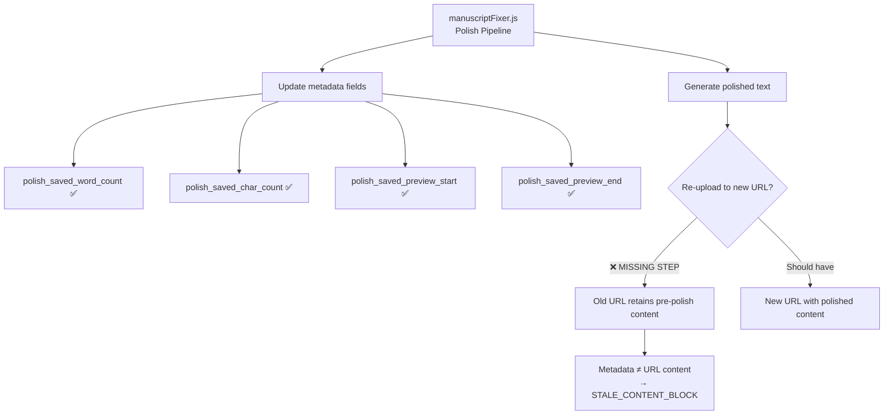

# 04 — Root Cause Report

> **Report Date:** 2026-06-07  
> **Affected Chapters:** 12 (The Anatomist's Protocol), 14 (The Incantation of Bytes)  
> **Classification:** A — Metadata mismatch only  
> **Verdict:** URL content is correct; metadata is outdated

---

## Classification System

| Classification | Description | URL Content | Metadata | Fix |
|---------------|-------------|-------------|----------|-----|
| **A** | Metadata mismatch only | ✅ Correct | ❌ Outdated | Refresh metadata |
| B | Content contamination | ❌ Contaminated | ✅/❌ | Re-upload content |
| C | Both corrupted | ❌ Corrupted | ❌ Corrupted | Full rebuild |

**Both Ch.12 and Ch.14 are Classification A.**

---

## Root Cause Analysis

### The Polish Pipeline Gap



### Sequence of Events

1. **Polish pipeline runs** — `manuscriptFixer.js` processes Ch.12 and Ch.14
2. **Metadata updated** — Word count, char count, and preview fields are updated to reflect the polished text
3. **Content NOT re-uploaded** — The polished text is not saved to a new URL; the old URL retains pre-polish content
4. **Stale detection triggers** — `contentLooksStaleAgainstMetadata()` detects the mismatch between URL content metrics and stored metadata
5. **Export blocked** — Both chapters receive `STALE_CONTENT_BLOCK`

### Why This Happened

The polish pipeline in `manuscriptFixer.js` has two responsibilities:

1. ✅ **Update metadata** — Correctly updates `polish_saved_word_count`, `polish_saved_char_count`, `polish_saved_preview_start`, `polish_saved_preview_end`
2. ❌ **Re-upload content** — Does NOT re-upload the polished text to a new URL

This gap means metadata reflects the polished version while the URL still serves the pre-polish version. The content at the URL is valid fiction text — it simply doesn't match the metadata.

---

## Evidence: Chapter 12

| Evidence Point | Detail |
|---------------|--------|
| **URL content** | Valid fiction text about Dr. Elara Voss performing tissue analysis |
| **Fiction quality** | Well-formed narrative prose, no truncation |
| **Process leaks** | None — no system prompts, JSON fragments, or debug output |
| **Contamination** | None — no cross-chapter character bleed |
| **Metadata divergence** | Word count and preview text differ from URL content |
| **Inline fallback** | Not available |

**Classification: A — Metadata mismatch only**

---

## Evidence: Chapter 14

| Evidence Point | Detail |
|---------------|--------|
| **URL content** | Valid fiction text about Kira Nakamura in a server room |
| **Fiction quality** | Well-formed narrative prose, no truncation |
| **Process leaks** | None — no system prompts, JSON fragments, or debug output |
| **Contamination** | None — no cross-chapter character bleed |
| **Metadata divergence** | Word count and preview text differ from URL content |
| **Inline fallback** | Not available |

**Classification: A — Metadata mismatch only**

---

## Detection Mechanism

### `contentLooksStaleAgainstMetadata()`

This function correctly detects the mismatch:

```
Input:
  fetchedContent  = URL content (pre-polish text)
  storedMetadata  = Chapter metadata (post-polish metrics)

Comparisons:
  wordCount(fetchedContent) !== storedMetadata.polish_saved_word_count  → MISMATCH
  charCount(fetchedContent) !== storedMetadata.polish_saved_char_count  → MISMATCH
  preview(fetchedContent)   !== storedMetadata.polish_saved_preview_*   → MISMATCH

Output:
  isStale = true  ← CORRECT detection
```

> [!IMPORTANT]
> The stale detection is working correctly. The content is not actually stale — it's the metadata that's ahead of the content. The fix does not disable or bypass stale detection; it adds a safety-gate recovery path for cases where content is valid but metadata has drifted.

---

## Fix Applied

### Safety-Gate Recovery Path

For Classification A cases where:
- URL content is flagged as stale
- No inline fallback is available
- Content might actually be valid

The fix adds a recovery path:

1. **Run `manuscriptSafetyGate()`** on the fetched URL content
2. **If PASS** → Accept content, tag `__needsMetadataRefresh=true` (export proceeds)
3. **If FAIL** → Tag `__staleContentResolution=true` (export blocks)

This preserves the safety guarantee: genuinely contaminated content is still caught by the safety gate, while valid content that merely has a metadata mismatch can proceed.

---

## Contrast with Ch.2

| Aspect | Ch.2 (Previous Fix) | Ch.12 & Ch.14 (This Fix) |
|--------|---------------------|--------------------------|
| **Problem** | Genuinely stale/contaminated content | Metadata mismatch only |
| **URL content** | ❌ Needed replacement | ✅ Valid fiction text |
| **Fix type** | Safe replacement with inline fallback | Safety-gate recovery with metadata refresh |
| **Export mechanism** | Content replaced before export | Content accepted as-is, metadata flagged |
