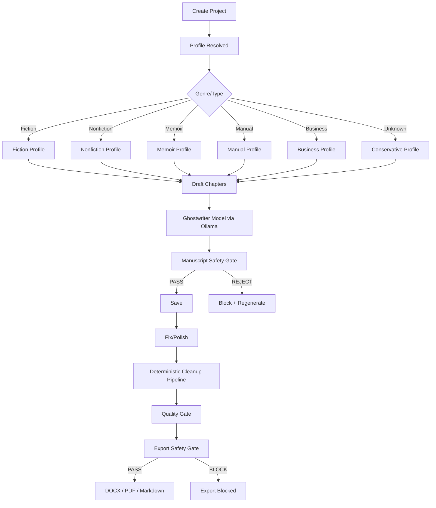
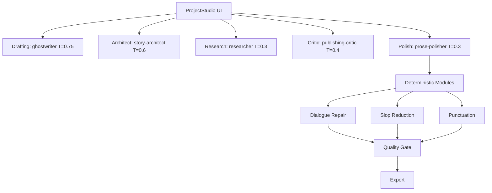
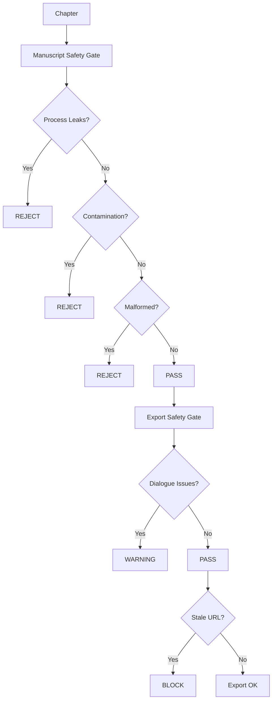
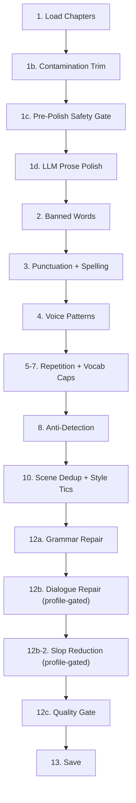

# UBS Detailed Workflow Charts

## Chart 1 — Full Author Workflow

```mermaid
flowchart TD
    A["Create Project"] --> B["Profile Resolved"]
    B --> C{"Genre/Type"}
    C -->|Fiction| D1["Fiction Profile"]
    C -->|Nonfiction| D2["Nonfiction Profile"]
    C -->|Memoir| D3["Memoir Profile"]
    C -->|Manual| D4["Manual Profile"]
    C -->|Business| D5["Business Profile"]
    C -->|Unknown| D6["Conservative Profile"]
    D1 & D2 & D3 & D4 & D5 & D6 --> E["Draft Chapters"]
    E --> F["Ghostwriter Model via Ollama"]
    F --> G["Manuscript Safety Gate"]
    G -->|PASS| H["Save"]
    G -->|REJECT| I["Block + Regenerate"]
    H --> J["Fix/Polish"]
    J --> K["Deterministic Cleanup Pipeline"]
    K --> L["Quality Gate"]
    L --> M["Export Safety Gate"]
    M -->|PASS| N["DOCX / PDF / Markdown"]
    M -->|BLOCK| O["Export Blocked"]
```

## Chart 2 — Agent/Model Pipeline

```mermaid
flowchart TD
    UI["ProjectStudio UI"] --> Draft["Drafting: ghostwriter T=0.75"]
    UI --> Arch["Architect: story-architect T=0.6"]
    UI --> Res["Research: researcher T=0.3"]
    UI --> Crit["Critic: publishing-critic T=0.4"]
    UI --> Pol["Polish: prose-polisher T=0.3"]
    Pol --> Det["Deterministic Modules"]
    Det --> DR["Dialogue Repair"]
    Det --> SR["Slop Reduction"]
    Det --> PQ["Punctuation"]
    DR & SR & PQ --> QG["Quality Gate"]
    QG --> Export["Export"]
```

## Chart 3 — Safety Gates

```mermaid
flowchart TD
    Content["Chapter"] --> MSG["Manuscript Safety Gate"]
    MSG --> PL{"Process Leaks?"}
    PL -->|Yes| BLOCK1["REJECT"]
    PL -->|No| CT{"Contamination?"}
    CT -->|Yes| BLOCK2["REJECT"]
    CT -->|No| MG{"Malformed?"}
    MG -->|Yes| BLOCK3["REJECT"]
    MG -->|No| PASS1["PASS"]
    PASS1 --> ESG["Export Safety Gate"]
    ESG --> DI{"Dialogue Issues?"}
    DI -->|Yes| WARN1["WARNING"]
    DI -->|No| PASS2["PASS"]
    PASS2 --> STALE{"Stale URL?"}
    STALE -->|Yes| BLOCK4["BLOCK"]
    STALE -->|No| EXPORT["Export OK"]
```

## Chart 4 — Polish Pipeline (Fiction, 13 Steps)

```mermaid
flowchart TD
    S1["1. Load Chapters"] --> S1b["1b. Contamination Trim"]
    S1b --> S1c["1c. Pre-Polish Safety Gate"]
    S1c --> S1d["1d. LLM Prose Polish"]
    S1d --> S2["2. Banned Words"]
    S2 --> S3["3. Punctuation + Spelling"]
    S3 --> S4["4. Voice Patterns"]
    S4 --> S5["5-7. Repetition + Vocab Caps"]
    S5 --> S8["8. Anti-Detection"]
    S8 --> S10["10. Scene Dedup + Style Tics"]
    S10 --> S12a["12a. Grammar Repair"]
    S12a --> S12b["12b. Dialogue Repair (profile-gated)"]
    S12b --> S12c["12b-2. Slop Reduction (profile-gated)"]
    S12c --> S12d["12c. Quality Gate"]
    S12d --> S13["13. Save"]
```
